# CVE-2023-27216 - DLink Router
This document is my personal experience of me - a newbie into firmware reversing and exploiting.
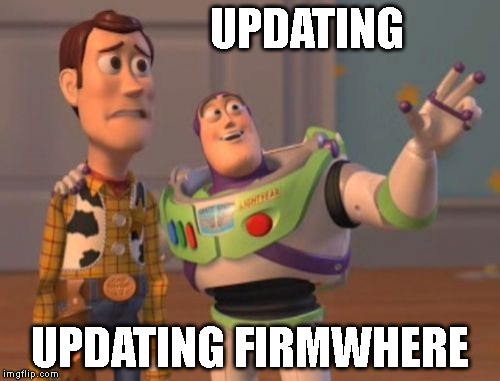

## Scope
For demonstration, we will analyze and reproduce `CVE-2023-27216`.
- **CVE number:** CVE-2023-27216
- **Vulnerability description:** An issue found in D-Link DSL-3782 v.1.03 allows remote authenticated users to execute arbitrary code - as root via the network settings page.
- **Equipment model:** D-Link DSL-3782
- **Firmware version:** DSL-3782_A1_EU_1.01
- **Manufacturer's official website:** http://www.dlink.com.cn/
- **Firmware address:** https://media.dlink.eu/support/products/dsl/dsl-3782/driver_software/dsl-3782_a1_eu_1.01_07282016.zip

## Tasks
In order to exploit any firmwares, there are following steps:
- [ ] Obtain the firmwares. There are 2 ways: extract them directly from the hardware (camera, router, printer, etc.) or you can get them from the manufacturer's website. This will be discussed in another document.
- [x] Analyze the firmware and find any vulnerabilities
- [x] Emulate the firmware.
- [x] Build `gdbserver` statically in order to debug.

## Firmware analyze
Usually a firmware binary file contain a bootloader (`uBoot`), a Kernel File, Kernel Header for bootloader (`uImage`) , a compressed file system (Generally in `SquashFS` format), A CRC/MD5 table(To verify File integrity) and other miscellaneous files.

Find a way to analyze the firmware first, do some research, got some resources:
- Binwalk to analyze, extract the firmware
- How to stimulate: [https://boschko.ca/qemu-emulating-firmware/](https://boschko.ca/qemu-emulating-firmware/)


### Extract important files
Extract firmware using binwalk: `binwalk -Me DSL-3782_A1_EU_1.01_07282016.bin`
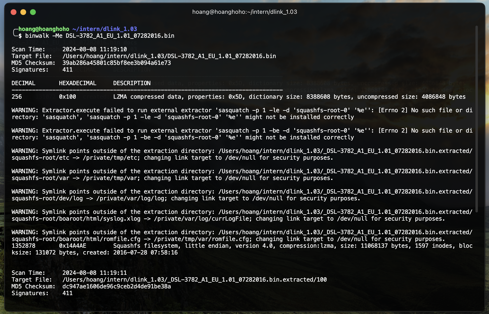

Got the extracted `squashfs-root` folder and some weird files.


**Bonus:** If you dont see `squashfs-root` folder, you use `unsquashfs` on any ".squashfs" files you see. They are just like zip files 😅.

### Analyze how the firmware works
Check the firmware architecture and endiane. This can be checked by checking some binaries extracted from the firmware. Check the architecture and firmware: `file <binary>`


Here we can almost confirm that the firmware runs on MIPS 32-bit MSB architecture. The reason for "almost" is because some firmware may run on different architecture with `MIPS Compatible` such as [Lexra](https://en.wikipedia.org/wiki/Lexra).

Check the `squashfs-root` folder and found some interesting files:
- `usr/etc/init.d/rcS` => This is the script that runs when the firmware boots up
- `usr/etc/passwd` => This is the file that contains the user information
- `userfs/romfile.cfg` => There is a credential `admin:admin`

Check the `rcS` file and found some interesting code:
```bash
echo "admin:$1$$iC.dUsGpxNNJGeOm1dFio/:0:0:root:/:/bin/sh" > /usr/etc/passwd
```
- This code is used to write the user information to the `passwd` file
- Run a webserver called [boa server](https://en.wikipedia.org/wiki/Boa_(web_server)). `Boa` is an ancient webserver, mainly used in embedded devices like routers back in the 2000’s. However, boa server has already stopped it’s development back in 2005! Even though Boa server is dead almost 20 years ago, it still lives to this day thanks to our vendor.
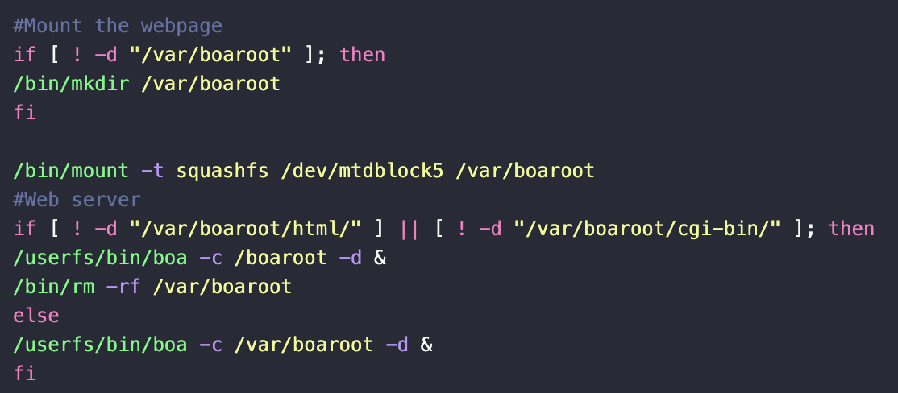


## Full system firmware emulation

I recommend using Debian based OS for the emulation process such as `Ubuntu` or `Kali`. There is another OS that centers around firmware hacking called [`AttifyOS`](https://www.attify.com/attifyos). In this document, I used Kali Linux. Start with stimulation process, there are 2 tools:
- [QEMU](https://www.qemu.org/) => Don't reinvent the wheels 🙏 🛐
- [FAT- Firmware-analysis-toolkit](https://github.com/attify/firmware-analysis-toolkit) => It works, you can read source code to know what it does.


Let's go through how to use `FAT` to fully emulate a firmware. First off, we clone the repo from github to your Kali machine. And go through setup process. You need to change the `fat.config` file too, otherwise it won't work.
```bash
git clone https://github.com/attify/firmware-analysis-toolkit.git

cd firmware-analysis-toolkit

./setup.sh

vi fat.config # Modify to your sudo password.
```

Then we copy the firmware binary (the one we downloaded from the manufacturer) to the folder of `FAT` on our Kali machine and run it.

```bash
./fat.py DSL-3782_A1_EU_1.01_07282016.bin
```

*Note*: During setup process of `FAT` we may encounter errors. It may say no libmagic.
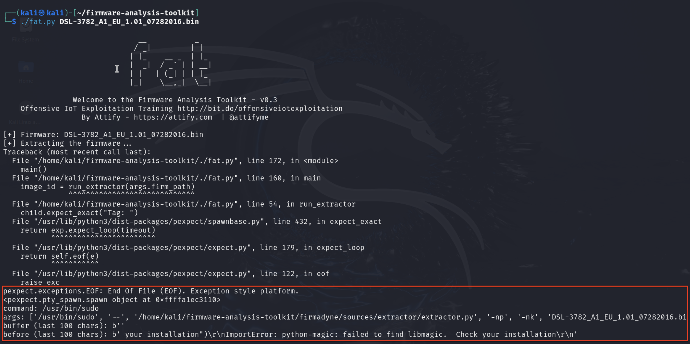

Just simply run
```bash
pip unistall python-magic
pip install python-magic
```

This should fix your problem, then we run the build command again. It should work like a charm now.

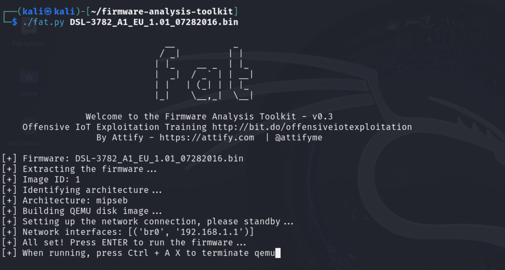

Press `Enter` to run. The emulation process should work nicely as you can browse to `http://192.168.1.1` (on Kali machine) to check if it works or not.


You can also login to the console if you got the credentials. Here is `admin:admin`.


If you decide to turn off the emulated firmware, just press `Ctrl+A X`. When you need to run again, do not run `fat.py` again because the firmware has already been built into an image. You only need to run the script which has already been generated.

```bash
cd firmadyne/scratch/<Image-ID>
./run.sh
```


## Debugger
Build `gdbserver` for debugging purpose. There are many ways to build `gdbserver`. You can also download statically built server. There is a [repo](https://github.com/stayliv3/gdb-static-cross/tree/master/prebuilt) that stores some statically built. However I prefer to built the `gdbserver` myself as the ones in the github repo are pretty old, it may encounter some compatibility issues.

Refer to this blog post for references [https://sheran.sg/blog/cross-compile-gdb-for-mips/](https://sheran.sg/blog/cross-compile-gdb-for-mips/). The blog was uploaded in 30 July 2024, just right before this project, so it works perfectly.
*Note*: The blog built for `MIPS x32 LSB` however we need `MIPS x32 MSB`. We need to change `mipsel-linux-gnu` to `mips-linux-gnu`.

### Build steps
We need to install tool chain for `MIPS`. Luckily, Debian package already has it.
```bash
**apt update && apt upgrade -y
apt install -y build-essential m4 gcc-mips-linux-gnu g++-mips-linux-gnu**
```

To build `gdbserver` for `MIPS`, there are a few packages that we need to build and install. Here is where I get the source.
1. gdb 15.1 - https://sourceware.org/pub/gdb/releases/gdb-15.1.tar.xz
2. GNU GMP lib v6.3.0 - https://gmplib.org/download/gmp/gmp-6.3.0.tar.xz
3. GNU MPFR lib v4.2.1 - https://www.mpfr.org/mpfr-current/mpfr-4.2.1.tar.xz

**Get the source**
```bash
wget https://sourceware.org/pub/gdb/releases/gdb-15.1.tar.xz
wget https://gmplib.org/download/gmp/gmp-6.3.0.tar.xz
wget https://www.mpfr.org/mpfr-current/mpfr-4.2.1.tar.xz
```

**Build libraries with toolchain**
It is crucial to have root privilege when we build these libraries. We have to first build GMP because it is a requirement when building MPFR.
```bash
tar xvf gmp-6.3.0.tar.xz && cd gmp-6.3.0
./configure --host=mips-linux-gnu
make -j$((`nproc`+1))
make install
cd ..
```

Then we build MPFR:
```bash
tar xvf mpfr-4.2.1.tar.xz && cd mpfr-4.2.1
./configure --host=mipsel-linux-gnu --with-gmp-build=<YOUR-FOLDER>/gmp-6.3.0
make -j$((`nproc`+1))
make install
cd ..
```

Now we can finally build gdbserver:
```bash
tar xvf gdb-15.1.tar.xz && cd gdb-15.1
./configure --host=mipsel-linux-gnu --with-gmp-lib=/usr/local/lib --with-mpfr-lib=/usr/local/lib --with-gmp-include=<YOUR-FOLDER>/gmp-6.3.0 --with-mpfr-include=<YOUR-FOLDER>/mpfr-4.2.1/src
make -j$((`nproc`+1)) LDFLAGS=-static
```

The built binary `gdbserver` should be in `gdb-15.1/gdbserver` folder.

### Push gdbserver to the firmware image
The emulated firmware does not have `wget`, `nc`, `curl`, `/dev/tcp`, ... We cannot host a Python HTTP Server to transfer files. We also don't have `ssh` neither. However, we can still put our `gdbserver` to the emulated machine by mounting the image.
- `sudo ./scripts/mount.sh 1`
- Copy **statically** built `gdbserver` to anywhere in the mounted folder.
- `sudo ./scripts/umount.sh 1`
- Reboot the qemu (execute `./run.sh` again just to be sure).

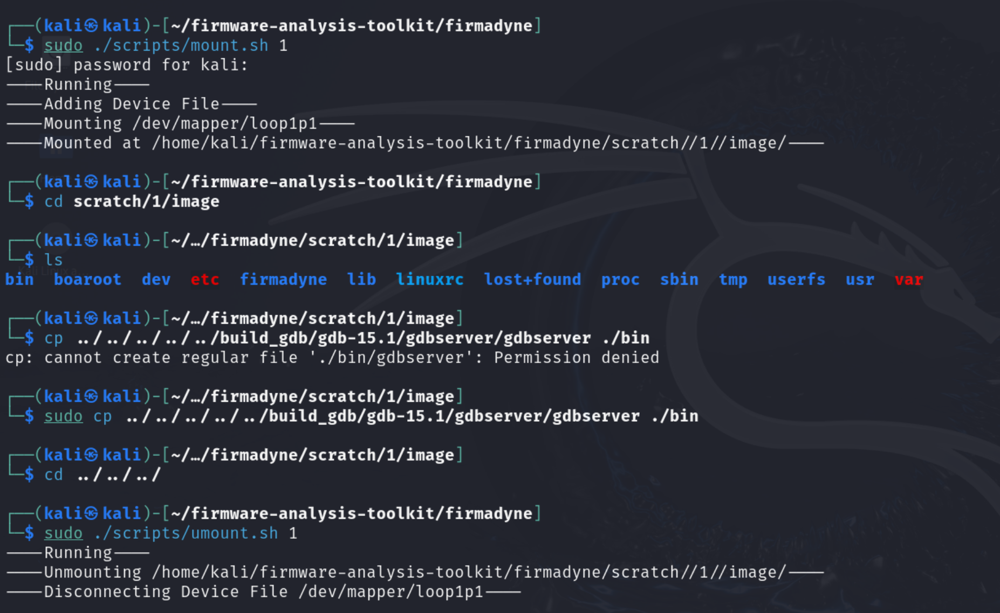


## Port forwarding
From now you can perform debugging and hacking inside Kali Machine. However, we can go a step further by port forwarding the emulated machine to our host machine (Windows or Mac).

### Inspect our network
Let's first check the network using `ifconfig`.
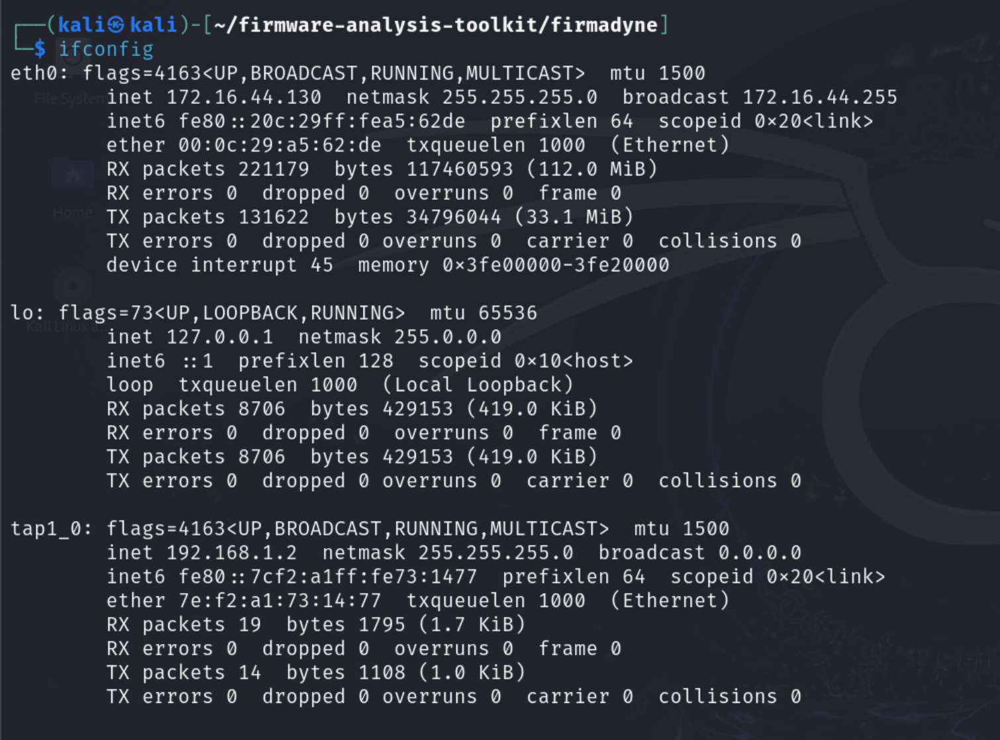

The result tells us that there are 2 interfaces: `eth0` and `tap1_0`. From what we know, the `eth0` interface of the shared network from host and the `tap1_0` is the interface of the emulated firmware machine.

For easier understanding, the network of `eth0` is like public network where we can access the Kali machine from the host machine. The `tap1_0` is like the private network where we can only access from the Kali machine. We need to forward the connection from `eth0` to the port `192.168.1.1:80` on `tap1_0` interface.

### Allow port forwarding
There are many tools that can help us with this. However. `iptables` seem to work the best, if you know how to config of course.

We must allow port forwarding first. Run this command:
```bash
echo 1 | sudo tee /proc/sys/net/ipv4/ip_forward
```
This only applies for one session only. If you want to apply it permanently, modify the content of `/etc/sysctl.conf`.
```bash
net.ipv4.ip_forward=1 # Find this line, uncomment it.
```
Save and close the file when you are finished.

Then apply the settings in this file. Run the following command:
```bash
sudo sysctl -p
sudo sysctl --system
```

### Port forwarding with iptables
Normally, we can run a bunch of `iptables` commands. But it will be too tedious 😵‍💫. We can install a tool `iptables-persistent`. It allows you to write a config file, load to file or extract chains to a file. All can be done quicly.
```bash
apt install iptables-persistent
```

The config file we want to modify here is `/etc/iptables/rules.v4`. We change the content of the file to the content below.
```bash
*filter
:INPUT ACCEPT [37:22880]
:FORWARD ACCEPT [0:0]
:OUTPUT ACCEPT [35:2330]
# Forward HTTP Port
-A FORWARD -i eth0 -o tap1_0 -p tcp --dport 80 -d 192.168.1.1 -j ACCEPT
-A FORWARD -i tap1_0 -o eth0 -p tcp --sport 80 -s 192.168.1.1 -j ACCEPT
# Forward Debugger port
-A FORWARD -i eth0 -o tap1_0 -p tcp --dport 31337 -d 192.168.1.1 -j ACCEPT
-A FORWARD -i tap1_0 -o eth0 -p tcp --sport 31337 -s 192.168.1.1 -j ACCEPT

COMMIT
# Completed on Wed Aug  7 09:32:11 2024
# Generated by iptables-save v1.8.10 (nf_tables) on Wed Aug  7 09:32:11 2024
*nat
:PREROUTING ACCEPT [60:5405]
:INPUT ACCEPT [0:0]
:OUTPUT ACCEPT [0:0]
:POSTROUTING ACCEPT [1096:50947]
-A PREROUTING -i eth0 -p tcp -j DNAT --to-destination 192.168.1.1
-A POSTROUTING -o tap1_0 -p tcp -d 192.168.1.1 -j MASQUERADE
```
>**Attention:** Allowing all ports generates bunch of security issues. It is recommended to `DROP` all ports then only `FORWARD` a few to your likings.

Save and renew the iptables chain.
```bash
service netfilter-persistent reload
```

As now you can access it from outside the host.
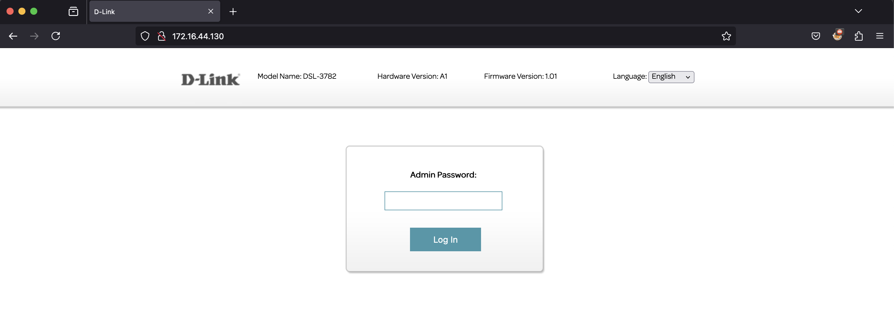

## Vulnerabilities
Multiple endpoints to exploit. 2 of them are inside `cfg_manager` binary. I only demonstrate 1 of it, the other I let you to figure out by yourself.

Throw the binary to your favourite decompiler, check for all `system` command, you may see this. The command runs a file called `/etc/lanconfig.sh`.

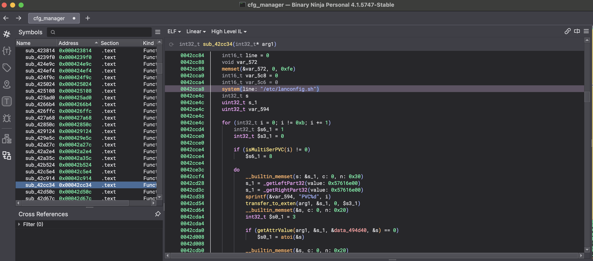

Checking for other places that may use this file, I found out a place where we can write the file.


Explaining with it does:
- The function opens `/etc/lanconfig.sh`
- The calls a function `mxmlElementGetAttr` which I guess that it finds an attribute from an object, could be directly or indirectly from HTTP Request, could be XML.
- It uses `sprintf` to make a string from the attributes obtained from `mxmlElementGetAttr`.
- Then it uses `fputs` to write to the file.

Immediatelly, I searched for any things in the web folder `boaroot` that is related to `IP`, `netmask` and found this. The documentation for boa webserver is extremely limited, I can only guess that it puts the POST param `lan_ip1` to `IP` params in an XML that gets called from the binary.

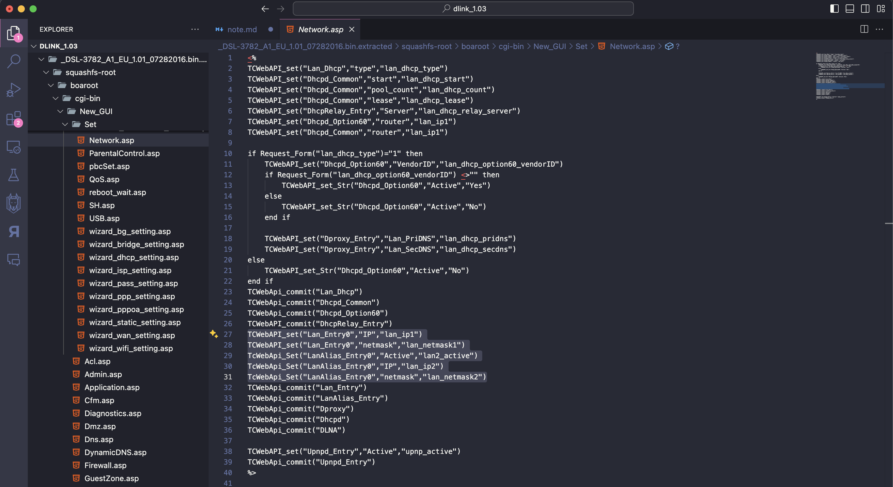

On the interface, we can find the request that triggers the bug. It is on **Settings > Network**


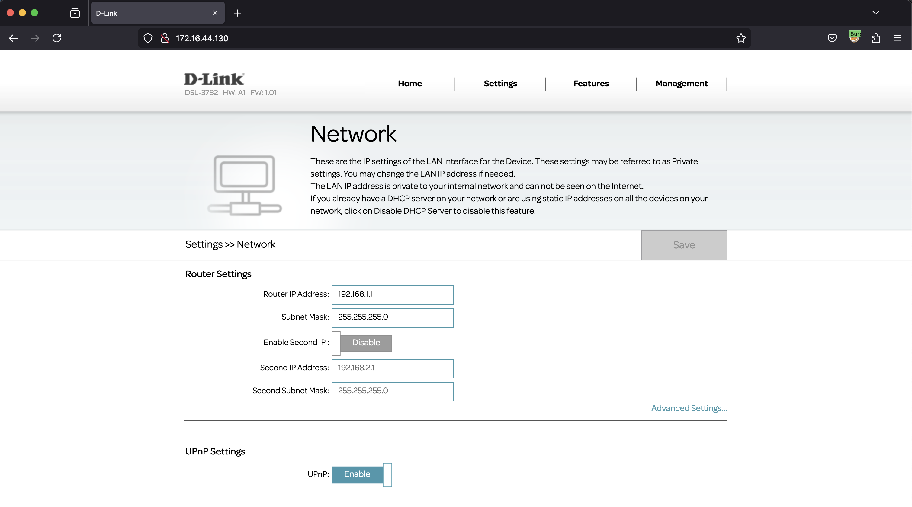

Intercept the request with Burpsuite when we press `Save`.

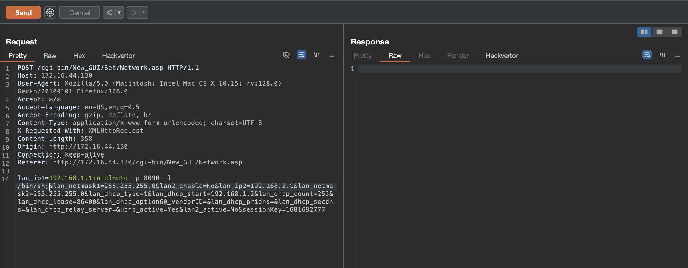

The payload `192.168.1.1;utelnetd -p 8090 -l /bin/sh;` is a reverse shell. We can execute connect to it.


## Bonus
Similar, could be better than `FAT` haven't tried -> [`FirmAE`](https://github.com/pr0v3rbs/FirmAE).

`Binary Ninja` is only 74$ if you have student status. The license can be shared to anyone.

Other bugs related to the `CVE`:


This can also lead to RCE to, I will leave you to do it yourself. The memory at that location `data_4c0160` can be injected somewhere 🫡.

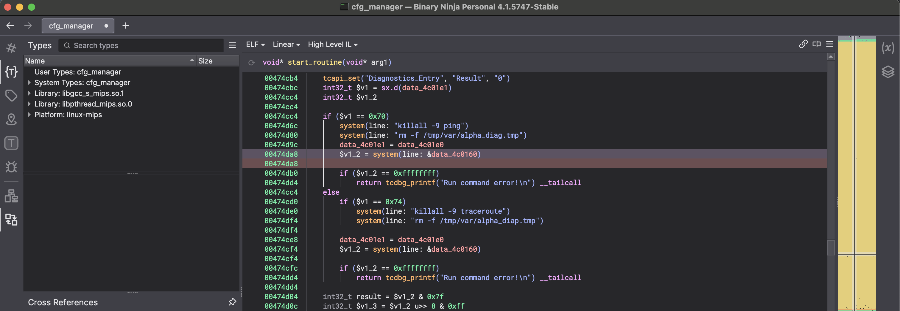


## References
- https://bbs.kanxue.com/thread-278413.htm
- https://secnigma.wordpress.com/2022/01/18/a-beginners-guide-into-router-hacking-and-firmware-emulation/
- https://www.ringzerolabs.com/2018/03/the-wonderful-world-of-mips.html
- https://sheran.sg/blog/cross-compile-gdb-for-mips/
- https://boschko.ca/qemu-emulating-firmware/
- https://wiki.bi0s.in/hardware/firmware/firmware-re/
- https://www.digitalocean.com/community/tutorials/how-to-forward-ports-through-a-linux-gateway-with-iptables
- https://www.youtube.com/watch?v=7W5YC8kenZE
